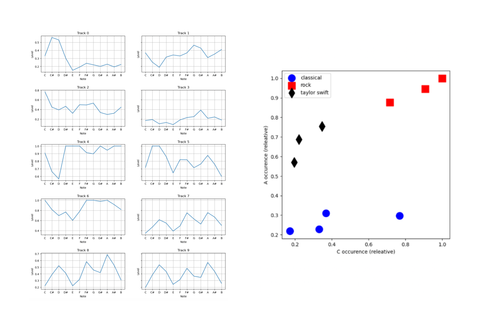

[Home](README.md) | [Week 1](week1.md) | [Week 2](week2.md) | [Week 3](week3.md) | [Week 4](week4.md) | [Week 5](week5.md) | [Week 7](week7.md) | [Week 8](week8.md) | [Week 9](week9.md) | [Week 10](week10.md)

# Week 10: Audio Similarity and Transcription
## Task 1: Similarity Matrix
Using the same three sections as in Week 9, I extracted the chroma features and saved them as CSV files in order to create a similarity matrix using Python. For the purposes of this matrix, tracks 0-3 are classical pieces, tracks 4-6 are rock pieces, and tracks 7, 8, and 9 are my three sections of the song *mirrorball*. I would place tracks 7-9 in the genre of indie/folk. Track 7 represents the bridge, track 8 represents the chorus, and track 9 represents the bridge. 
### Mean Representation of All Tracks and 2D Similarities of A and C

### Similarity Matrix in 2 Dimensions and 12 Dimensions

## Task 2: Transcription
For the second half of this week's task, I converted my WAV file of *mirrorball* into a MIDI file in order to compare it with the original score. I opened the MIDI file in MuseScore to see the transcription displayed as a score. Below are the results of the first two pages of each score: 
### WAV File Transcription

### MIDI File Recreation

### Analysis
The first detail that I noticed when comparing the WAV score with the MIDI score was the number of staves. In the original piece, there is a treble clef stave for the vocals, and two staves for the piano (treble and bass). In the MIDI transcription there is only two staves, instead of the original three. When played in MuseScore, the MIDI file sounds almost identical to the original WAV file, however the sheet music is very confusing and almost illegible. This is due to the vocal stave being converted added to the piano staves and combined with the original piano score. Another difference I noticed is that the original trancription is in D major, compared to the MIDI score which is in D♭ major. This isn't a huge difference and doesn't really effect the overall listening experience of the MIDI file compared to the WAV file. A factor that hugely effects the usability of the MIDI score is the over complication of the transcription - the addition of multiple rests in every bar, notes floating between staves, and treble and bass clefs dotted around the score suggests that MuseScore wasn't completely successful in reading the MIDI file and transcribing it well. I am not a piano player myself but I suspect anyone that tried to play this score would be unsuccessful or have great difficulty. The original transcription is a lot more simple and readable and therefore for transcription purposes was a much more succesful method of creating a score. 

---

[<-- Previous - Week 9](week9.md) 

