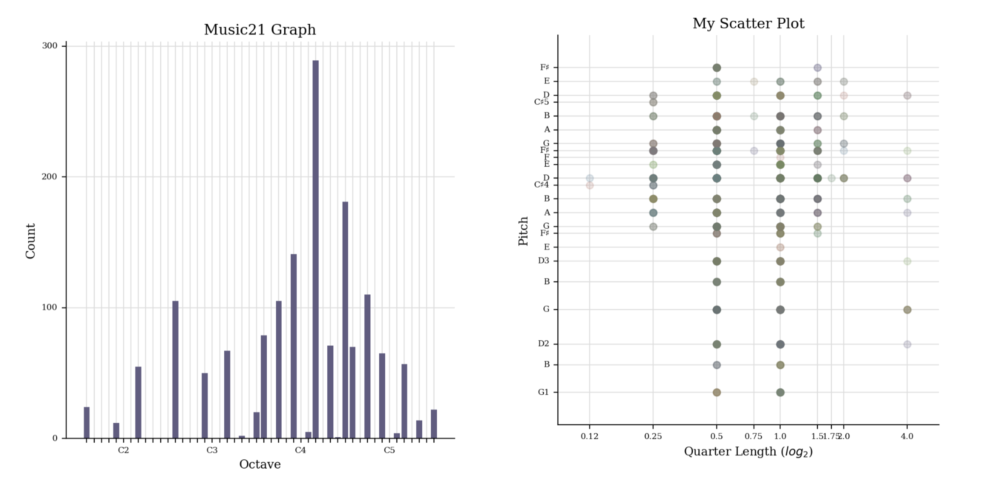
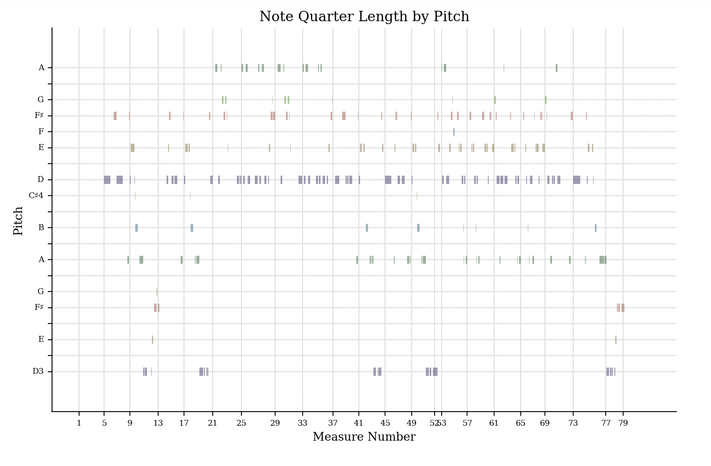

[Home](README.md) | [Week 1](week1.md) | [Week 2](week2.md) | [Week 3](week3.md) | [Week 4](week4.md) | [Week 5](week5.md) | [Week 7](week7.md) | [Week 8](week8.md) | [Week 9](week9.md) | [Week 10](week10.md)

# Week 4: Computational Analytics of Notated Music
## Task 1: music21 
### Graphs
Below are the three graphs that I generated usng music21. The first graph (left) is a histogram representing the pitch of the piece. The second graph (right) is a scatter graph representing pitch by length of quarter note. The third graph (bottom) is a piano roll. 

---

[<-- Previous - Week 3](week3.md) ---------------------------------------------------------------------------------------------------------------------------------------------------- [Next - Week 5 -->](week5.md)
