[Home](README.md) | [Week 1](week1.md) | [Week 2](week2.md) | [Week 3](week3.md) | [Week 4](week4.md) | [Week 5](week5.md) | [Week 7](week7.md) | [Week 8](week8.md) | [Week 9](week9.md) | [Week 10](week10.md)

# Week 9: Analysing and Extracting Meaning from Audio
## Task 1: Extract Features
As I am largely focussing on Taylor Swift's song *'mirrorball'* for my project, I decided to split the song into  sections and choose three of these to feature in my analysis rather than find three other songs. The sections I chose are the first verse, the chorus, and the bridge. I chose these as they seemed like obvious divisions in the music and all hold characterstics not found in the other sections. Below are the Spectrograms, the Mel Frequency Cepstral Coefficients (MFCC), and the Chromagrams for each sections:
### Verse
Spectrogram 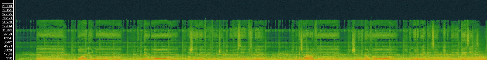
MFCC 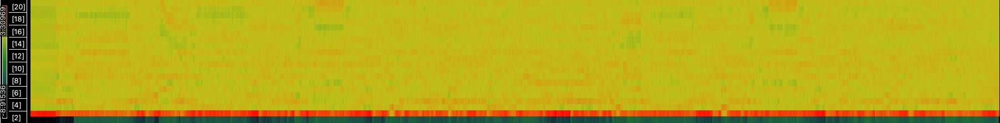
Chromogram 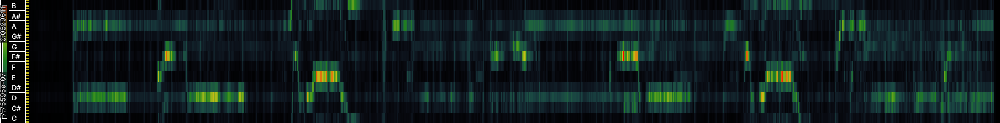
### Chorus
Spectrogram 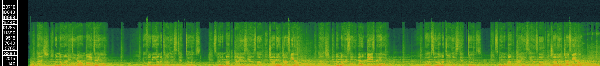
MFCC 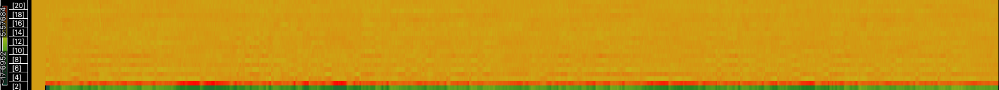
Chromogram 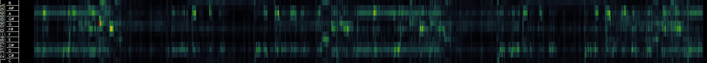
### Bridge
Spectrogram 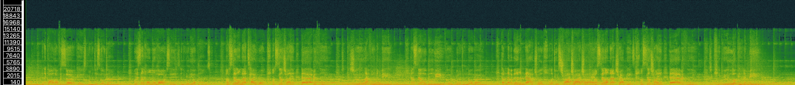
MFCC 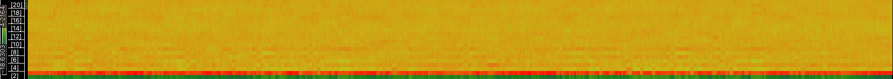
Chromogram 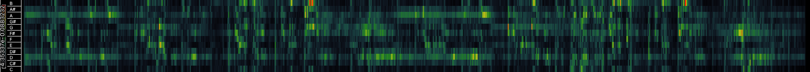

## Task 2: Compute and visualise features with histograms
Each pane for each section was saved as a CSV file and uploaded to the Python workbook. Below are the histograms that were created using Python. 
### MFCC Histograms
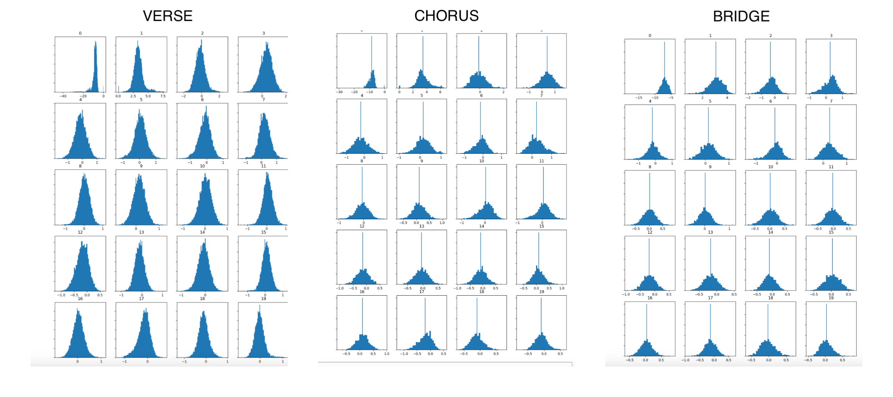
### Spectrogram Histograms
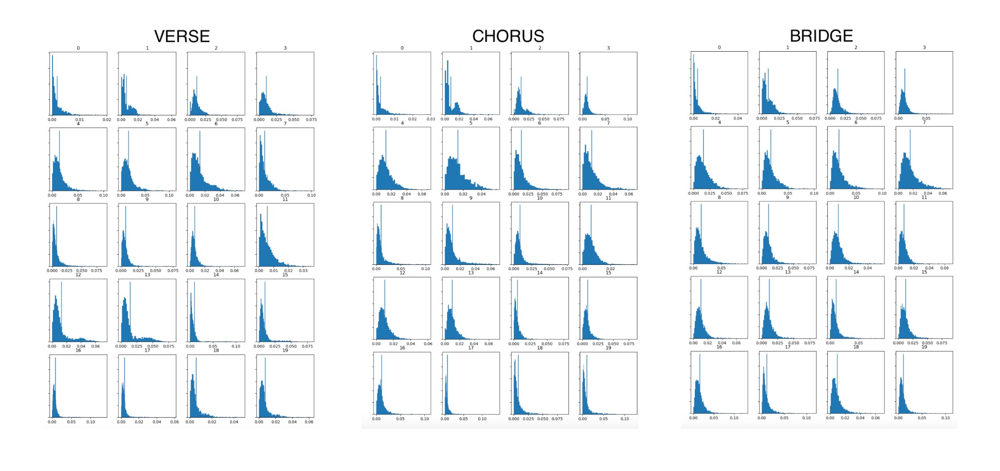
### Chroma Histograms
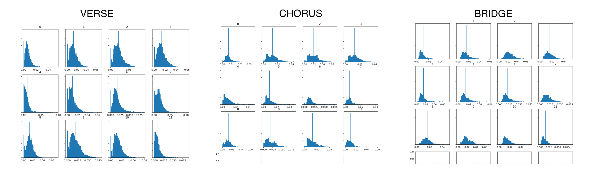

### Analysis of Histograms

