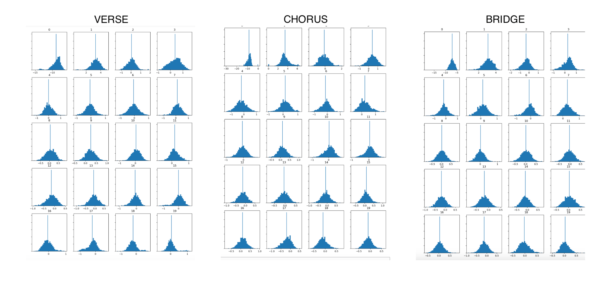
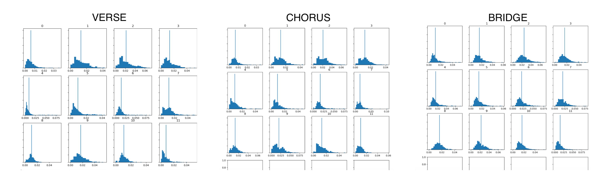

[Home](README.md) | [Week 1](week1.md) | [Week 2](week2.md) | [Week 3](week3.md) | [Week 4](week4.md) | [Week 5](week5.md) | [Week 7](week7.md) | [Week 8](week8.md) | [Week 9](week9.md) | [Week 10](week10.md)

# Week 9: Analysing and Extracting Meaning from Audio
## Task 1: Extract Features
As I am largely focussing on Taylor Swift's song *'mirrorball'* for my project, I decided to split the song into  sections and choose three of these to feature in my analysis rather than find three other songs. The sections I chose are the first verse, the chorus, and the bridge. I chose these as they seemed like obvious divisions in the music and all hold characterstics not found in the other sections. Below are the Spectrograms, the Mel Frequency Cepstral Coefficients (MFCC), and the Chromagrams for each sections:
### Verse
Spectrogram 
MFCC 
Chromogram 
### Chorus
Spectrogram 
MFCC 
Chromogram 
### Bridge
Spectrogram 
MFCC 
Chromogram 

## Task 2: Compute and visualise features with histograms
Each pane for each section was saved as a CSV file and uploaded to the Python workbook. Below are the histograms that were created using Python. 
### MFCC Histograms

### Spectrogram Histograms

### Chroma Histograms

### Analysis of Histograms
For this task, I will be analysing the MFCC histograms. MFCCs are often used to analyse the timbre of a track and understand the distribution of energy. We can see from these histograms that all three sections of the song are very similar and have a very similar timbre and tonal quality. Looking at the histograms after listening to the song, this doesn’t surprise me at all. The entire song is quite similar and has the same melodies and refrains repeated throughout. The histograms are all centred and pretty symmetrical too, with none of them overly skewed either left or right, expect perhaps Histogram 0. Despite all of the sections being very similar, there are parts where two sections might be more similar to each other than another section. For example, in Histogram 1 the bridge and the verse are a lot more similar than the chorus, and in Histogram 19 the chorus and the bridge are much more similar than the verse. These differences are slight but can be seen, just like in the actual track. The bridge of the song links the final chorus to the outro and creates a slight contrast to the rest of the song. Due to the cohesiveness of the song and the similarity that is represented throughout, the timbre of the bridge isn’t very different to the rest of the song and is rather an even mix of the verse and chorus with many of the bridge histograms matching almost identically with the corresponding verse or chorus histogram. 

---

[<-- Previous - Week 8](week8.md) ---------------------------------------------------------------------------------------------------------------------------------------------------- [Next - Week 10 -->](week10.md)
